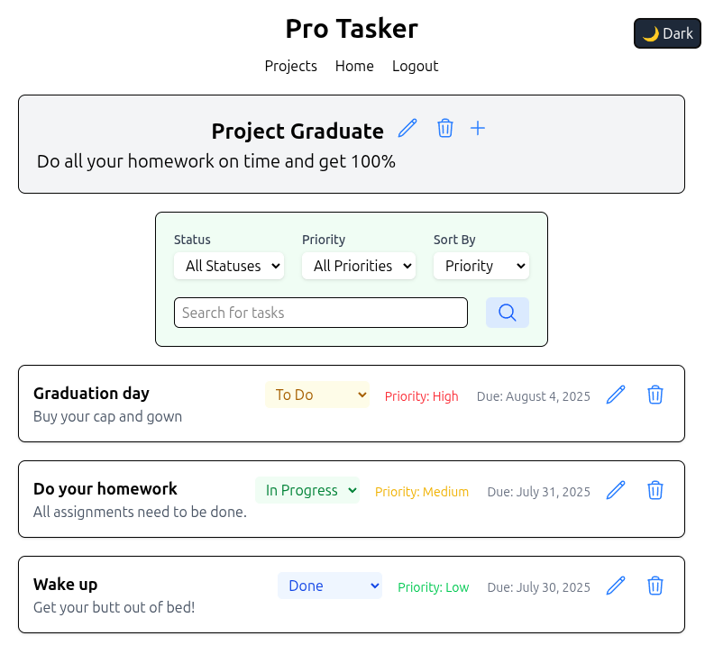

# Pro Tasker - Project Management

This project provides a full-stack application for project and task management, Pro Tasker. The solution provides a modern, collaborative project management tool that is intuitive for single users but powerful enough for small teams. The application is built from the ground up using the MERN stack, showcasing a secure, robust, and feature-rich backend API, a dynamic and responsive React frontend, and a seamless deployment pipeline.

## Table of contents

- [🛠️ Tech Stack](#%EF%B8%8F-tech-stack)
  - [🚀 Core Stack](#-core-stack)
  - [🎨 UI & Stylin](#-ui--styling)
  - [🔐 Authentication & Security](#-authentication--security)
  - [🧰 Dev Tools & Utilities](#-dev-tools--utilities)
  - [🧪 Testing & Debugging](#-testing--debugging)
  - [📦 Deployment](#-deployment)
  - [⏱️ Scheduling / Automation](#%EF%B8%8F-scheduling--automation)
- [Overview](#overview)
  - [The challenge](#the-challenge)
  - [Screenshot](#screenshot)
  - [Links](#links)
- [My process](#my-process)
  - [Built with](#built-with)
  - [What I learned](#what-i-learned)
- [Author](#author)
- [Acknowledgments](#acknowledgments)

## 🛠️ Tech Stack

### 🚀 Core Stack

### 🎨 UI & Styling

### 🔐 Authentication & Security

### 🧰 Dev Tools & Utilities

### 🧪 Testing & Debugging

### 📦 Deployment

### ⏱️ Scheduling / Automation

## Overview

### The challenge

The application provides secure row-level authenticated functionality to allow clients to:

- User Management:
- As a new user, I can create an account and log in.
- As a logged-in user, my session is managed securely, and I can log out.
- Project Management:
- As a logged-in user, I can create new projects, giving them a name and description.
- I can view a dashboard of all the projects I have created.
- I can view the details of a single project.
- I can update or delete only the projects that I own.
- Task Management:
- Within a project I own, I can create new tasks with a title, description, and status (e.g., ‘To Do’, ‘In Progress’, ‘Done’).
- I can view all tasks belonging to a specific project.
- I can update the details or status of any task within a project I own.
- I can delete tasks from a project I own.

### Screenshot

### Links

- Live Site URL: (https://fiel.us/pro-tasker/)

## My process

### Built with

- Node.js & Express: Server setup, modular routing, middleware implementation, and RESTful API design.
- MongoDB & Mongoose: Complex schema design with relationships (ref), data validation, and advanced Mongoose queries for CRUD operations.
- Authentication & Authorization: JWT-based user authentication (registration and login), password hashing with bcrypt, and multi-layered, ownership-based authorization rules.
- TSC transpiling and bundling

### What I learned

This API required several chained Mongoose database queries in order to pull and verify ids and ownership before making changes to the data. This can be done in multiple ways, so it was good to explore these options and choose better performing queries that don't require full collection pulls to work.

## Author

David Fiel

- Website - [David Fiel](https://fiel.us)

## Acknowledgments

- Thanks to Per Scholas!
